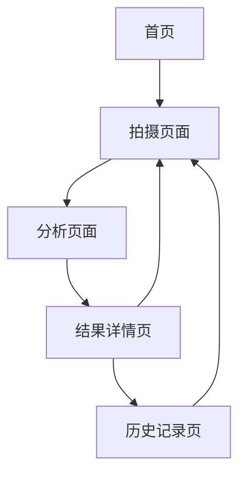

# 手相分析应用需求文档

## 1. 产品概述
本产品是一个基于React的手相分析网页应用，通过调用用户摄像头获取手部图像，结合外部大模型API进行智能分析，为用户提供个性化的手相解读服务。
- 解决用户对手相了解的需求，提供便捷的在线手相分析体验
- 面向对手相文化感兴趣的普通用户，无需专业知识即可获得手相解读
- 目标是打造一个易用、准确、有趣的手相分析工具，满足用户的娱乐和探索需求

## 2. 核心功能

### 2.1 用户角色
| 角色 | 注册方式 | 核心权限 |
|------|----------|----------|
| 普通用户 | 无需注册，直接使用 | 可拍摄手部照片、获取手相分析结果、查看历史记录 |

### 2.2 功能模块
我们的手相分析应用包含以下主要页面：
1. **首页**：产品介绍、快速开始按钮、功能展示
2. **拍摄页面**：摄像头调用、实时预览、拍照功能、拍摄指导
3. **分析页面**：图像上传、AI分析进度、分析结果展示
4. **结果详情页**：详细手相解读、特征标注、建议说明
5. **历史记录页**：历史分析记录、结果对比、数据管理

### 2.3 页面详情
| 页面名称 | 模块名称 | 功能描述 |
|----------|----------|----------|
| 首页 | 产品介绍区 | 展示应用功能特点、使用流程说明、开始体验入口 |
| 首页 | 功能展示区 | 展示手相分析样例、用户评价、技术优势介绍 |
| 拍摄页面 | 摄像头控制 | 调用用户摄像头、实时视频预览、拍照按钮、重新拍摄功能 |
| 拍摄页面 | 拍摄指导 | 显示手部放置指导线、拍摄提示文字、最佳拍摄角度说明 |
| 分析页面 | 图像处理 | 显示拍摄的手部图像、图像质量检测、重新拍摄选项 |
| 分析页面 | AI分析进度 | 显示分析进度条、分析状态提示、预计完成时间 |
| 结果详情页 | 手相特征展示 | 标注手部关键特征点、生命线/智慧线/感情线识别、手型分类 |
| 结果详情页 | 解读内容 | 显示详细的手相分析结果、性格特点解读、运势趋势分析 |
| 历史记录页 | 记录列表 | 显示历史分析记录、分析时间、缩略图预览 |
| 历史记录页 | 数据管理 | 删除记录、导出结果、分享功能 |

## 3. 核心流程
用户使用流程如下：
1. 用户访问首页，了解产品功能
2. 点击开始分析，进入拍摄页面
3. 根据指导调整手部位置，拍摄清晰的手部照片
4. 系统自动跳转到分析页面，调用外部AI API进行手相识别
5. 分析完成后展示结果详情，用户可查看详细解读
6. 用户可在历史记录页面查看之前的分析结果

## 4. 用户界面设计
### 4.1 设计风格
- 主色调：深蓝色(#1a365d)和金色(#d69e2e)，营造神秘而专业的氛围
- 辅助色：浅灰色(#f7fafc)作为背景色，深灰色(#2d3748)作为文字色
- 按钮样式：圆角按钮设计，主要按钮采用渐变效果
- 字体：中文使用"PingFang SC"，英文使用"Inter"，主要字号16px，标题字号24px
- 布局风格：卡片式设计，顶部导航栏，响应式布局
- 图标风格：使用线性图标，配合手相主题的神秘元素

### 4.2 页面设计概览
| 页面名称 | 模块名称 | UI元素 |
|----------|----------|--------|
| 首页 | 产品介绍区 | 大标题、副标题、特色功能卡片、渐变背景、开始按钮 |
| 首页 | 功能展示区 | 手相分析示例图、用户评价轮播、技术特点图标 |
| 拍摄页面 | 摄像头控制 | 圆形预览窗口、拍照按钮(圆形，金色)、重拍按钮、返回按钮 |
| 拍摄页面 | 拍摄指导 | 半透明指导框、动画提示、文字说明、进度指示器 |
| 分析页面 | 图像处理 | 手部图像预览、质量检测结果、重新拍摄链接 |
| 分析页面 | AI分析进度 | 环形进度条、分析状态文字、预计时间显示、加载动画 |
| 结果详情页 | 手相特征展示 | 手部图像、特征点标注、颜色编码线条、放大镜功能 |
| 结果详情页 | 解读内容 | 分类标签、解读文本、评分显示、分享按钮 |
| 历史记录页 | 记录列表 | 时间轴布局、缩略图、分析日期、快速预览 |
| 历史记录页 | 数据管理 | 删除按钮、导出选项、批量操作、搜索筛选 |

### 4.3 响应式设计
产品采用移动优先的响应式设计，支持桌面端和移动端访问，针对触摸操作进行优化，确保在不同设备上都有良好的用户体验。